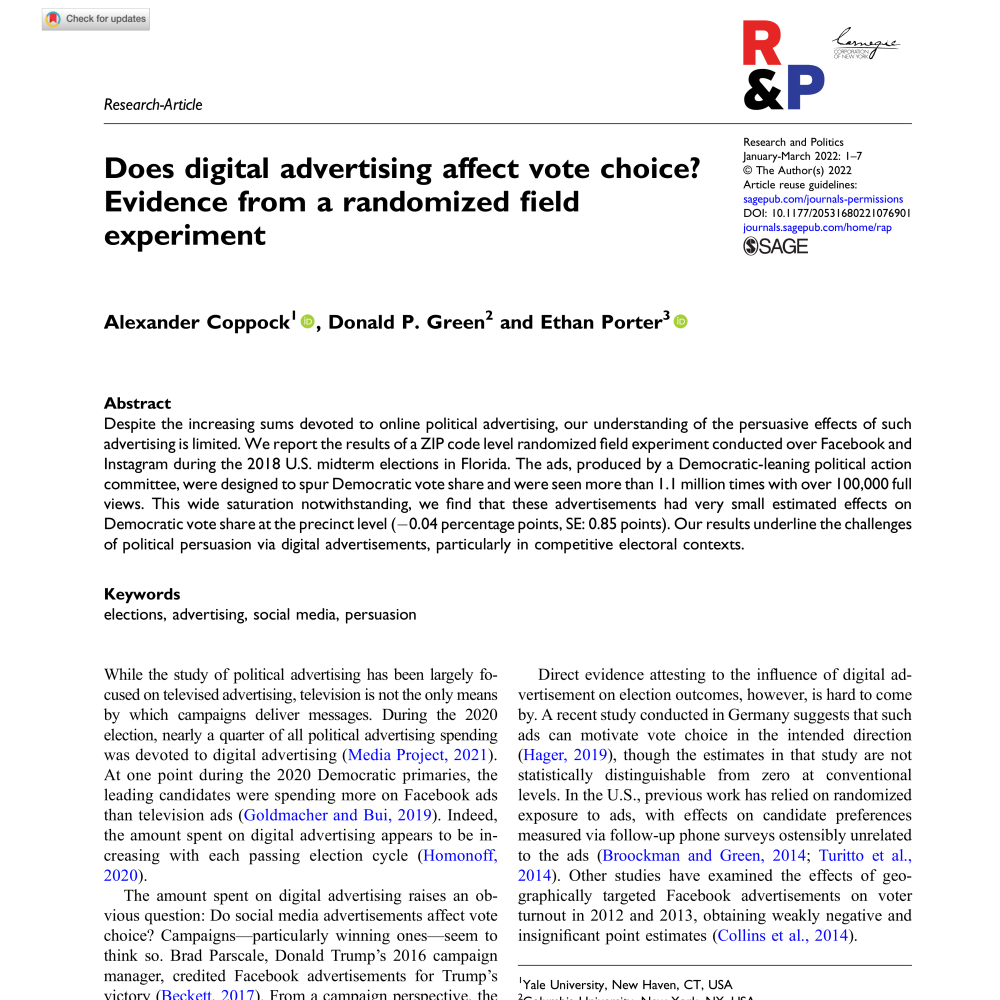
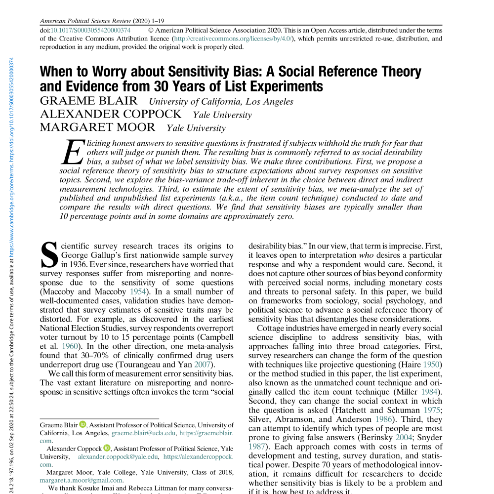
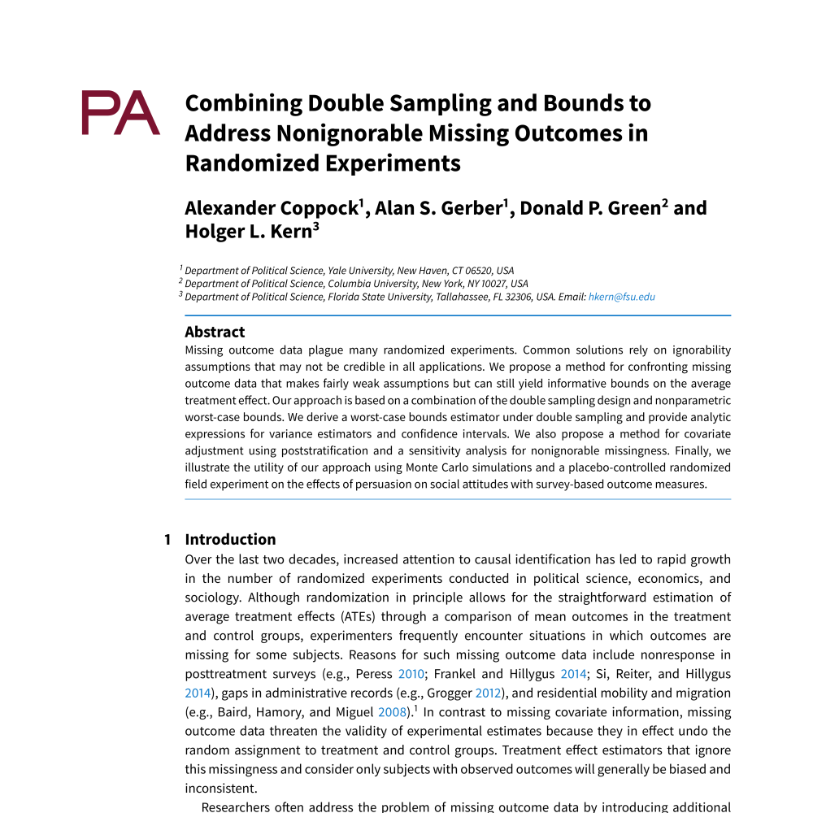

<!--html_preserve-->

 

 Galos, Diana Roxana, Alexander Coppock. 2023. <b>Gender Composition Predicts Gender Bias: A Meta-reanalysis of Hiring Discrimination Audit Experiments</b>. Science Advances. 

 Aggarwal, Minali, Jennifer Allen, Andrew Beasley, James Barnes, Alexander Coppock, Dan Frankowski, Solomon Messing, Kelly Zhang, Sylvan Zheng. 2023. <b>The impact of digital advertising on turnout during the 2020 US presidential election: evidence from a massive campaign-level field experiment</b>. Nature Human Behavior. 

 Coppock, Alexander, Donald P. Green, Ethan Porter. 2022. <b>Does Digital Advertising Affect Vote Choice? Evidence from a Randomized Field Experiment</b>. Research \& Politics. 

 Coppock, Alexander, Dipin Kaur. 2022. <b>Qualitative Imputation of Missing Potential Outcomes</b>. American Journal of Political Science. 

 Schwarz, Susanne, Alexander Coppock. 2022. <b>What Have We Learned About Gender From Candidate Choice Experiments? A Meta-analysis of 67 Factorial Survey Experiments</b>. Journal of Politics. 

 Coppock, Alexander, Donald P. Green. 2022. <b>Do Belief Systems Exhibit Dynamic Constraint?</b>. Journal of Politics. 

 Offer-Westort, Molly, Alexander Coppock, Donald P. Green. 2021. <b>Adaptive Experimental Design: Prospects and Applications in Political Science</b>. American Journal of Political Science. 

 Graham, Matthew, Alexander Coppock. 2021. <b>Asking About Attitude Change</b>. Public Opinion Quarterly. 

 Peer, Limor, Lilla Orr, Alexander Coppock. 2021. <b>Active Maintenance: A Proposal for the Long-term Computational Reproducibility of Scientific Results</b>. PS: Political Science \& Politics. 

 Coppock, Alexander, Hill, Seth J., Vavreck, Lynn. 2020. <b>The Small Effects of Political Advertising are Small Regardless of Context, Message, Sender, or Receiver: Evidence from 59 Real-time Randomized Experiments</b>. Science Advances. 

 Blair, Graeme, Alexander Coppock, Margaret Moor. 2020. <b>When to Worry About Sensitivity Bias: Evidence from 30 Years of List Experiments</b>. American Political Science Review. 

 Guess, Andrew, Coppock, Alexander. 2020. <b>Does Counter-Attitudinal Information Cause Backlash? Results from Three Large Survey Experiments</b>. British Journal of Political Science. 

 Coppock, Alexander. 2020. <b>Visualize As You Randomize: Design-based Statistical Graphs for Randomized Experiments</b>. Advances in Experimental Political Science. 

 Blair, Graeme, Cooper, Jasper, Coppock, Alexander, Humphreys, Macartan. 2019. <b>Declaring and Diagnosing Research Designs</b>. American Political Science Review. 

 Yokum, David, Ravishankar, Anita, Coppock, Alexander. 2019. <b>A Randomized Control Trial Evaluating the Effects of Police Body-worn Cameras</b>. Proceedings of the National Academy of Sciences. 

 Coppock, Alexander. 2019. <b>Generalizing from Survey Experiments Conducted on Mechanical Turk: A Replication Approach</b>. Political Science Research and Methods. 

 Coppock, Alexander, Oliver A. McClellan. 2019. <b>Validating the Demographic, Political, Psychological, and Experimental Results Obtained from a New Source of Online Survey Respondents</b>. Research \& Politics. 

 Coppock, Alexander. 2019. <b>Avoiding Post-Treatment Bias in Audit Experiments</b>. Journal of Experimental Political Science. 

 Coppock, Alexander, Emily Ekins, David Kirby. 2018. <b>The Long-lasting Effects of Newspaper Op-Eds on Public Opinion</b>. Quarterly Journal of Political Science. 

 Kirkland, Patricia A., Alexander Coppock. 2018. <b>Candidate Choice Without Party Labels: New Insights from Conjoint Survey Experiments</b>. Political Behavior. 

 Coppock, Alexander, Leeper, Thomas J., Mullinix, Kevin J.. 2018. <b>Generalizability of Heterogeneous Treatment Effect Estimates Across Samples</b>. Proceedings of the National Academy of Sciences. 

 Alejandro Flores, Alexander Coppock. 2018. <b>Do Bilinguals Respond More Favorably to Candidate Advertisements in English or in Spanish?</b>. Political Communication. 

 Coppock, Alexander, Alan S. Gerber, Donald P. Green, Holger L. Kern. 2017. <b>Combining Double Sampling and Bounds to Address Nonignorable Missing Outcomes in Randomized Experiments</b>. Political Analysis. 

 Coppock, Alexander. 2017. <b>Did Shy Trump Supporters Bias the 2016 Polls? Evidence from a Nationally-representative List Experiment</b>. Statistics, Politics and Policy. 

 Coppock, Alexander, Green, Donald P.. 2016. <b>Is Voting Habit Forming? New Evidence from Experiments and Regression Discontinuities</b>. American Journal of Political Science. 

 Coppock, Alexander, Andrew Guess, John Ternovski. 2016. <b>When Treatments are Tweets: A Network Mobilization Experiment over Twitter</b>. Political Behavior. 

 Coppock, Alexander. 2016. <b>Information Spillovers: Another Look at Experimental Estimates of Legislator Responsiveness---CORRIGENDUM</b>. Journal of Experimental Political Science. 

 Green, Donald P., Jonathan S. Krasno, Alexander Coppock, Benjamin D. Farrer, Brandon Lenoir, Joshua N. Zingher. 2016. <b>The Effects of Lawn Signs on Vote Outcomes: Results from Four Randomized Field Experiments</b>. Electoral Studies. 

 Aronow, Peter M., Coppock, Alexander, Crawford, Forrest W., Green, Donald P.. 2015. <b>Combining List Experiment and Direct Question Estimates of Sensitive Behavior Prevalence</b>. Journal of Survey Statistics and Methodology. 

 Coppock, Alexander, Donald P. Green. 2015. <b>Assessing the Correspondence Between Experimental Results Obtained in the Lab and Field: A Review of Recent Social Science Research</b>. Political Science Research and Methods. 

 Coppock, Alexander. 2014. <b>Information Spillovers: Another Look at Experimental Estimates of Legislator Responsiveness</b>. Journal of Experimental Political Science. 

<!--/html_preserve-->