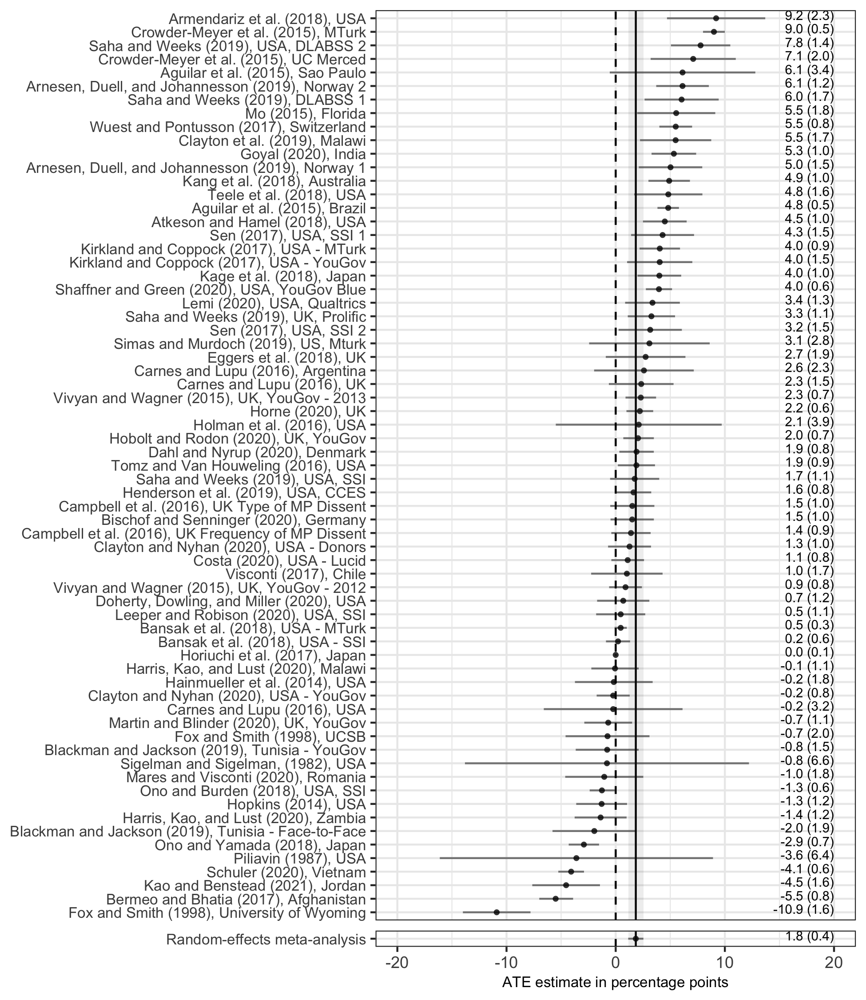

```{r setup, include=FALSE}
knitr::opts_chunk$set(echo = TRUE)
```

Schwarz, Susanne, Alexander Coppock. 2022. <b>What Have We Learned About Gender From Candidate Choice Experiments? A Meta-analysis of 67 Factorial Survey Experiments</b>. Journal of Politics.

# Abstract
Candidate choice survey experiments in the form of conjoint or vignette experiments have become a standard part of the political science toolkit for understanding the effects of candidate characteristics on vote choice. We collect 67 such studies from all over the world and reanalyze them using a standardized approach. We find that the average effect of being a woman (relative to a man) is a gain of approximately 2 percentage points. We find some evidence of heterogeneity across contexts, candidates, and respondents. The difference is somewhat larger for white (versus black) candidates, and among survey respondents who are women (versus men) or, in the U.S. context, identify as Democrats or Independents (versus Republicans). Our results add to the growing body of experimental and observational evidence that voter preferences are not a major factor explaining the persistently low rates of women in elected office.

# Links
 - <a href='schwarz_coppock_2022.pdf' target='_blank'>Link to paper</a>
 - <a href='schwarz_coppock_2022_appendix.pdf'target='_blank'>Link to appendix</a>
 - <a href='https://doi.org/10.1086/716290'target='_blank'>Journal site</a>
 - <a href='https://doi.org/10.7910/DVN/R27ULT'target='_blank'>Replication archive</a>

 - <a href= 'https://suschwarz.com' target='_blank'>Susanne Schwarz's website</a>
 - <a href='schwarz_coppock_2022.txt'target='_blank'>Bibtex citation</a>

# Figure
<center></center>