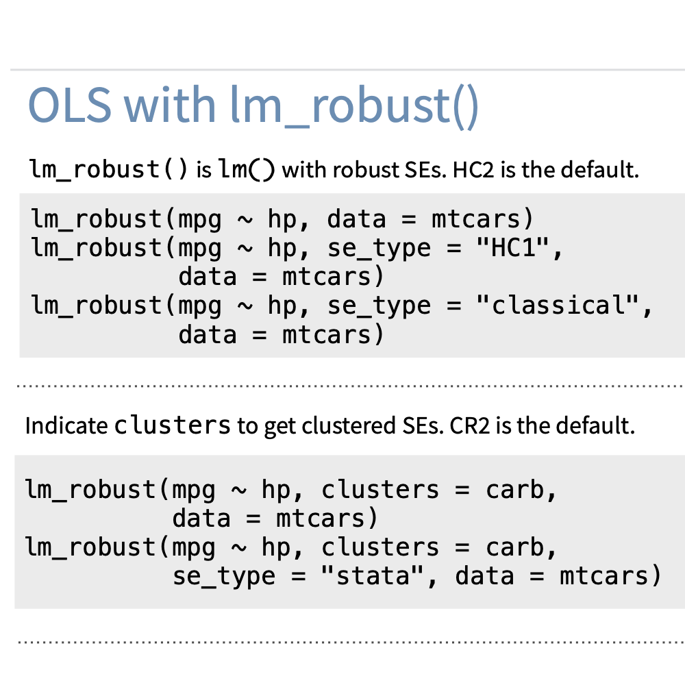
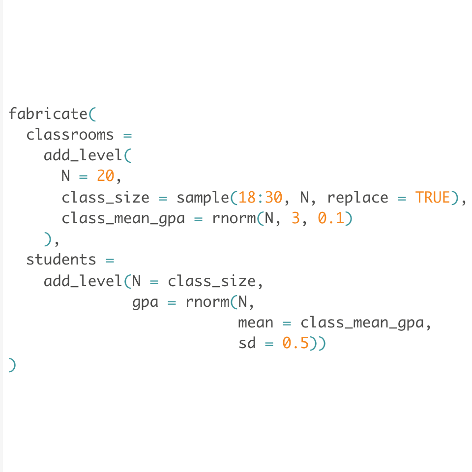
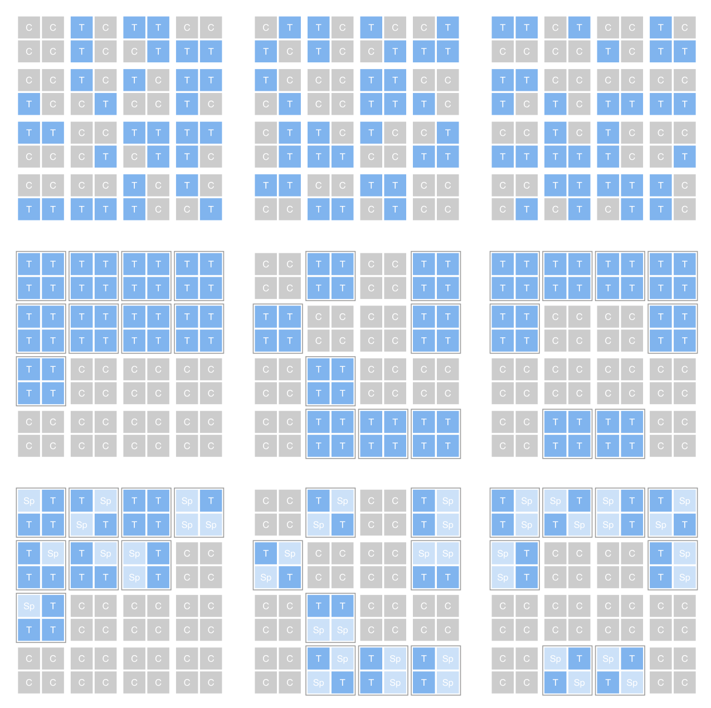
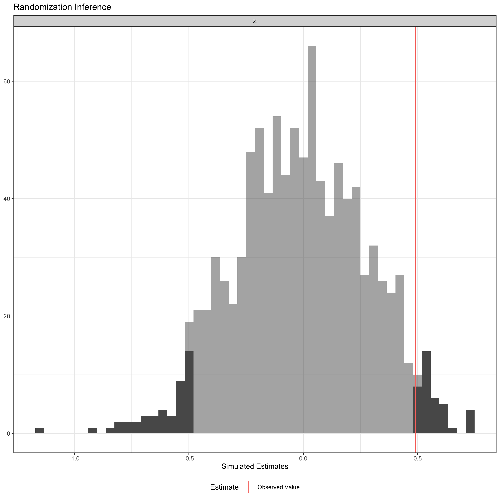

<!--html_preserve-->

 

 Graeme Blair, Jasper Cooper, Alexander Coppock, Macartan Humphreys, Neal Fultz. 2018. <b>DeclareDesign: Declare and Diagnose Research Designs</b>. R package version 0.28.0. 

 Graeme Blair, Jasper Cooper, Alexander Coppock, Macartan Humphreys, Luke Sonnet. 2020. <b>estimatr: Fast Estimators for Design-Based Inference</b>. R package version 0.22.0. 

 Graeme Blair, Jasper Cooper, Alexander Coppock, Macartan Humphreys, Aaron Rudkin, Neal Fultz. 2019. <b>fabricatr: Imagine Your Data Before You Collect It</b>. R package version 0.10.0. 

 Alexander Coppock, Jasper Cooper, Neal Fultz. 2015. <b>randomizr: Easy-to-Use Tools for Common Forms of Random Assignment and Sampling</b>. R package version 0.20.0. 

 Alexander Coppock. 2019. <b>ri2: Randomization Inference for Randomized Experiments</b>. R package version 0.1.2. 

<!--/html_preserve-->