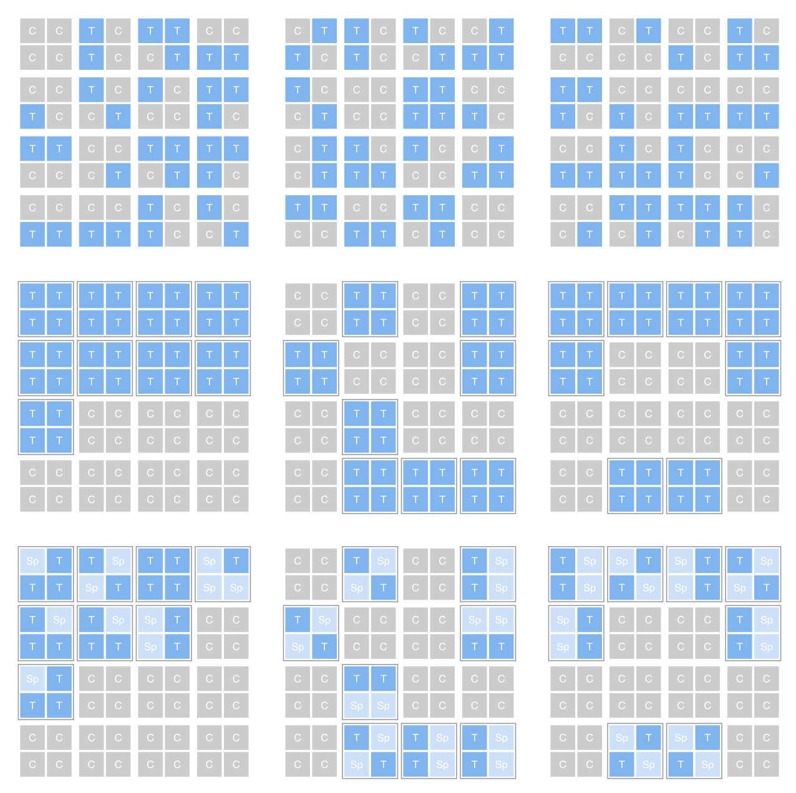
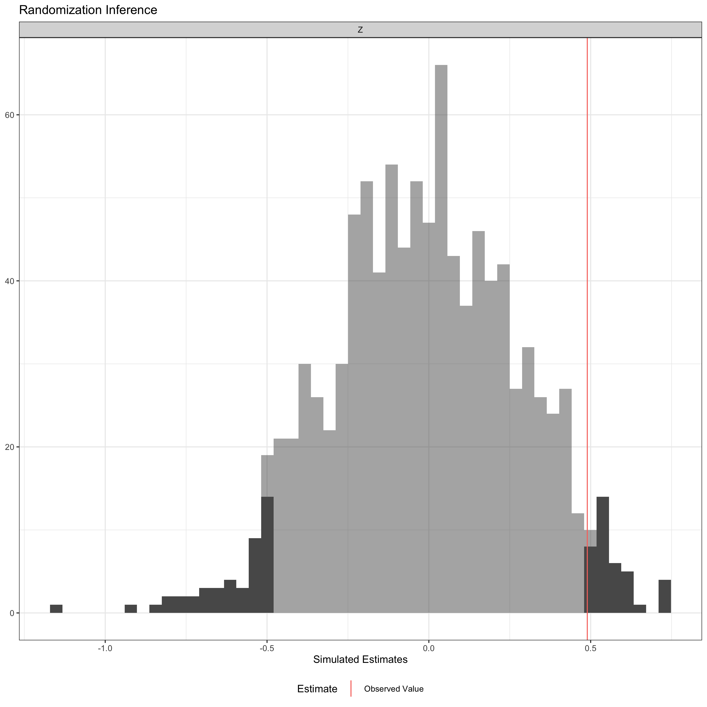

<!--html_preserve-->

 

 Blair, Graeme, Jasper Cooper, Alexander Coppock, Macartan Humphreys, and Neal Fultz. 2018. <b>DeclareDesign: Declare and Diagnose Research Designs</b>. R package version 0.28.0. <a href='https://doi.org/10.32614/cran.package.declaredesign' target='_blank'>doi:10.32614/cran.package.declaredesign</a> 

 Blair, Graeme, Jasper Cooper, Alexander Coppock, Macartan Humphreys, and Luke Sonnet. 2020. <b>estimatr: Fast Estimators for Design-Based Inference</b>. R package version 0.22.0. <a href='https://doi.org/10.32614/cran.package.estimatr' target='_blank'>doi:10.32614/cran.package.estimatr</a> 

 Blair, Graeme, Jasper Cooper, Alexander Coppock, Macartan Humphreys, Aaron Rudkin, and Neal Fultz. 2019. <b>fabricatr: Imagine Your Data Before You Collect It</b>. R package version 0.10.0. <a href='https://doi.org/10.32614/cran.package.fabricatr' target='_blank'>doi:10.32614/cran.package.fabricatr</a> 

 Coppock, Alexander, Jasper Cooper, and Neal Fultz. 2015. <b>randomizr: Easy-to-Use Tools for Common Forms of Random Assignment and Sampling</b>. R package version 0.20.0. <a href='https://doi.org/10.32614/cran.package.randomizr' target='_blank'>doi:10.32614/cran.package.randomizr</a> 

 Coppock, Alexander. 2019. <b>ri2: Randomization Inference for Randomized Experiments</b>. R package version 0.1.2. <a href='https://doi.org/10.32614/cran.package.ri2' target='_blank'>doi:10.32614/cran.package.ri2</a> 

<!--/html_preserve-->