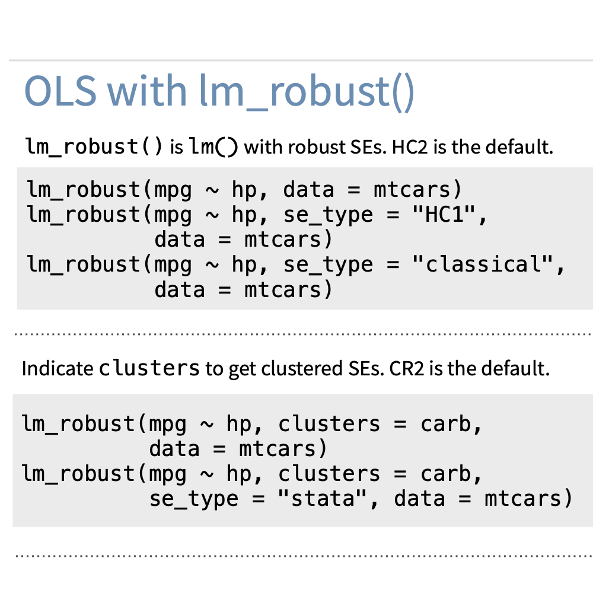
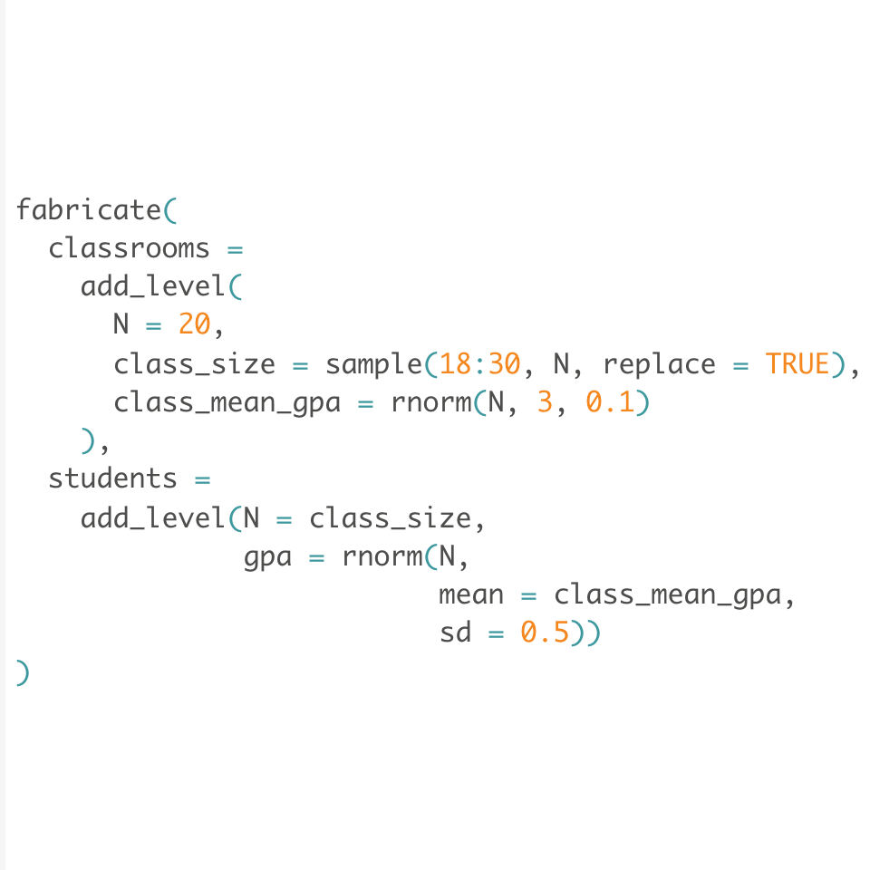
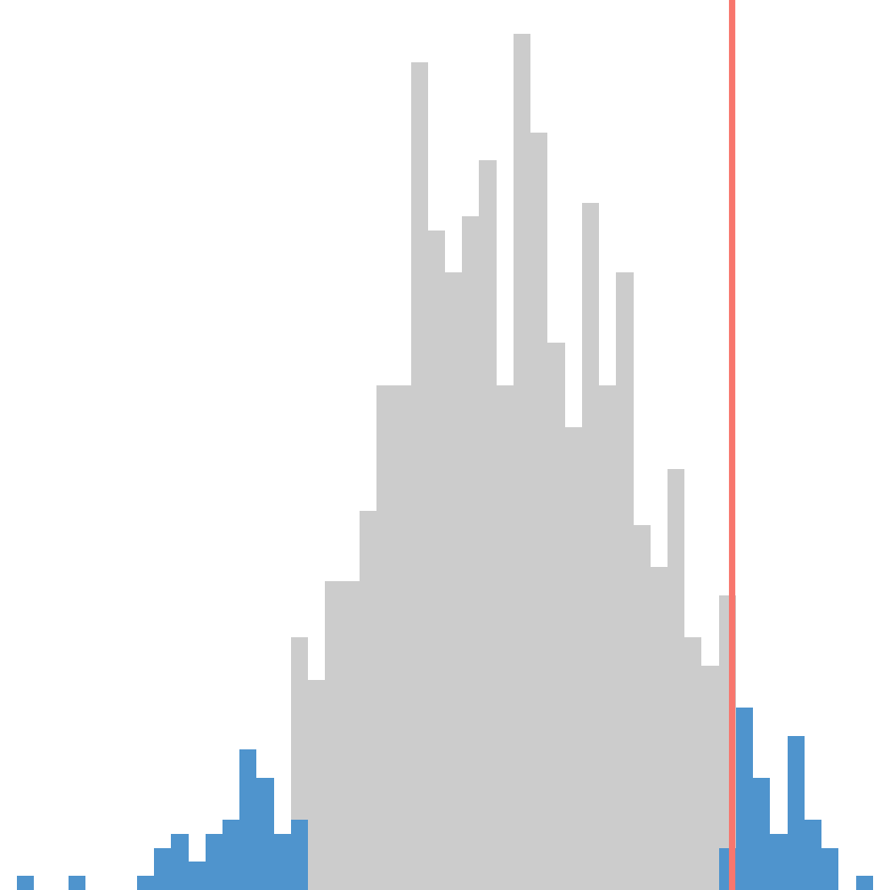

<!--html_preserve-->

 

 Blair, Graeme, Jasper Cooper, Alexander Coppock, Macartan Humphreys, and Neal Fultz. 2018. <b>DeclareDesign: Declare and Diagnose Research Designs</b>. R package version 0.28.0. 

 Blair, Graeme, Jasper Cooper, Alexander Coppock, Macartan Humphreys, and Luke Sonnet. 2020. <b>estimatr: Fast Estimators for Design-Based Inference</b>. R package version 0.22.0. 

 Blair, Graeme, Jasper Cooper, Alexander Coppock, Macartan Humphreys, Aaron Rudkin, and Neal Fultz. 2019. <b>fabricatr: Imagine Your Data Before You Collect It</b>. R package version 0.10.0. 

 Coppock, Alexander, Jasper Cooper, and Neal Fultz. 2015. <b>randomizr: Easy-to-Use Tools for Common Forms of Random Assignment and Sampling</b>. R package version 0.20.0. 

 Coppock, Alexander. 2019. <b>ri2: Randomization Inference for Randomized Experiments</b>. R package version 0.1.2. 

<a class="galleryItemLabel" href="https://alexandercoppock.com/vayr/">vayr: Extensions for 'ggplot2' to Visualize as You Randomize</a>

 Coppock, Alexander. 2025. <b>vayr: Extensions for 'ggplot2' to Visualize as You Randomize</b>. R package version 1.0.0. 

<a class="galleryItemLabel" href="https://alexandercoppock.com/excheckr/">excheckr: Tools for Exploring and Checking Experimental Data</a>

 Coppock, Alexander. 2025. <b>excheckr: Tools for Exploring and Checking Experimental Data</b>. R package version 0.1.0. 

<a class="galleryItemLabel" href="https://alexandercoppock.com/metaprep/">metaprep: Tidy Preparation of Dependent Effect Estimates for Meta-Analysis</a>

 Coppock, Alexander. 2025. <b>metaprep: Tidy Preparation of Dependent Effect Estimates for Meta-Analysis</b>. R package version 0.4.0. 

<a class="galleryItemLabel" href="https://alexandercoppock.com/estimatrTools/">estimatrTools: Data-Driven Covariate Adjustment for the 'estimatr' Estimators</a>

 Coppock, Alexander. 2026. <b>estimatrTools: Data-Driven Covariate Adjustment for the 'estimatr' Estimators</b>. R package version 0.1.0. 

<a class="galleryItemLabel" href="https://alexandercoppock.com/conjointmatchups/">conjointmatchups: Reshape and Extract Matchups from Forced-Choice Conjoint Experiments</a>

 Coppock, Alexander. 2026. <b>conjointmatchups: Reshape and Extract Matchups from Forced-Choice Conjoint Experiments</b>. R package version 0.0.0.9000. 

<!--/html_preserve-->