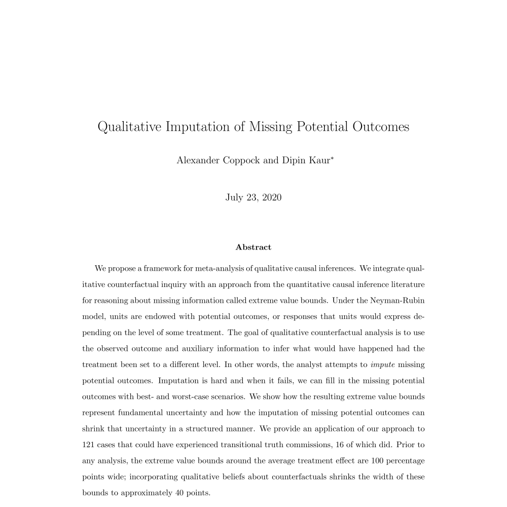

<!--html_preserve-->

 

 Coppock, Alexander, Dipin Kaur. 2020. <b>Qualitative Imputation of Missing Potential Outcomes</b>. Unpublished manuscript. 

 Peyton, Kyle, Huber, Gregory A., Coppock, Alexander. 2020. <b>The Generalizability of Online Experiments Conducted During The COVID-19 Pandemic</b>. Unpublished manuscript. 

 Coppock, Alexander. 2018. <b>A Field Experimental Test of Vote Swapping</b>. Unpublished manuscript. 

 Coppock, Alexander. 2017. <b>The Persistence of Survey Experimental Treatment Effects</b>. Unpublished manuscript. 

<!--/html_preserve-->