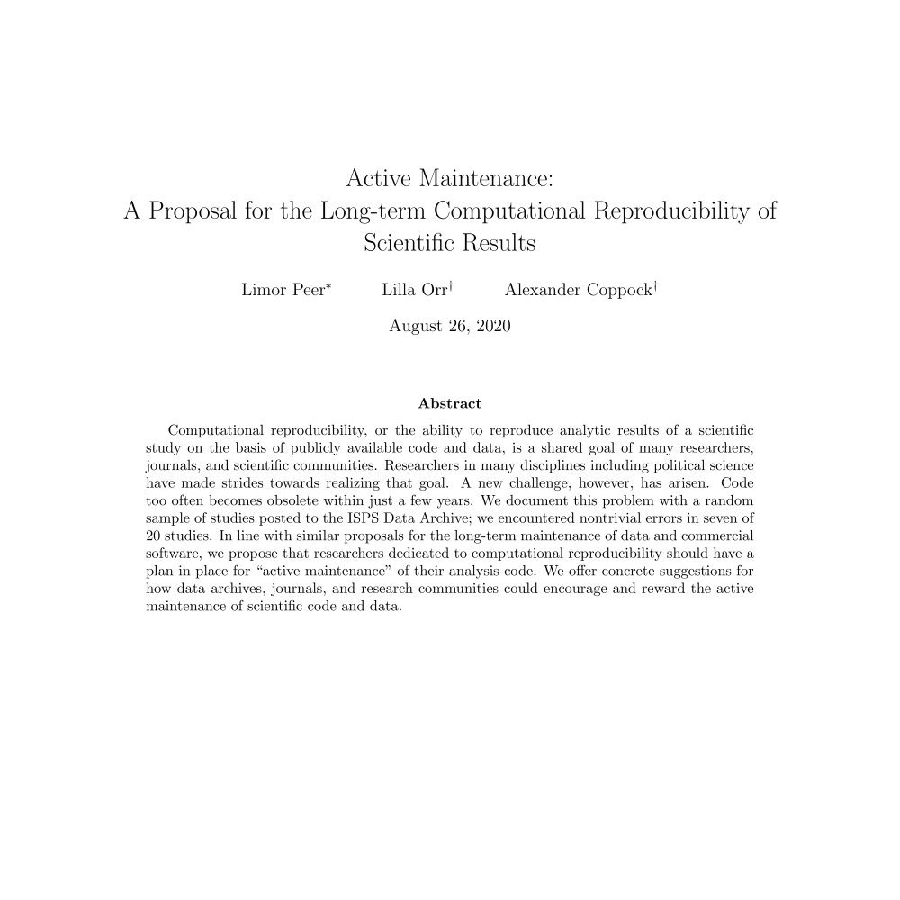

---
title: "Working Papers"
output:
html_document:
toc_float: false
---
<!--html_preserve-->

 

 Peer, Limor, Lilla Orr, Alexander Coppock. 2020. Active Maintenance: A Proposal for the Long-term Computational Reproducibility of Scientific Results. Unpublished manuscript. 

 Coppock, Alexander, Dipin Kaur. 2020. Qualitative Imputation of Missing Potential Outcomes. Unpublished manuscript. 

 Coppock, Alexander. 2018. A Field Experimental Test of Vote Swapping. Unpublished manuscript. 

 Coppock, Alexander. 2017. The Persistence of Survey Experimental Treatment Effects. Unpublished manuscript. 

<!--/html_preserve-->